# Framework Overview

## Diagrama de arquitectura

Este diagrama muestra como se relacionan los componentes principales del
framework, los agentes, el contexto compartido, las integraciones y las fuentes
de persistencia.

```mermaid
flowchart TB
    director["Javier / Director<br/>Operador y aprobador unico"]
    vscode["VS Code + CLI ariwalabs<br/>Entrada local de trabajo"]
    github["GitHub<br/>Fuente de verdad tecnica"]

    subgraph repo["Repositorio versionado"]
        docs["docs/<br/>Arquitectura, ADRs, backlog y logs"]
        framework_policies["framework/policies/<br/>Politicas core"]
        business_packs["business_packs/<br/>Packs de dominio"]
        shared_context["shared/context/<br/>Contexto empresarial compartido"]
        shared_policies["shared/policies/<br/>Politicas historicas default"]
        agents["agents/<br/>Definiciones de agentes"]
        prompts["prompts/codex/<br/>Prompts operativos"]
        tests["tests/<br/>Validaciones y regresion"]
    end

    subgraph framework["AriwaLabs Agent Framework"]
        framework_agent["Framework Agent<br/>Gobierna agentes y releases"]
        runtime["Agent Runtime<br/>Crea y ejecuta ejecuciones locales"]
        agent_registry["Agent Registry<br/>Catalogo y versiones"]
        skill_registry["Skill Registry<br/>Contratos de skills"]
        context_engine["Context Engine<br/>Carga contexto compartido"]
        workflow_engine["Workflow Engine<br/>Estados, pasos y checkpoints"]
        model_gateway["Model Gateway<br/>Perfiles logicos de modelos"]
        tool_gateway["Tool Gateway<br/>Acceso controlado a tools"]
        approval_engine["Approval Engine<br/>Aprobacion humana"]
        evaluation_engine["Evaluation Engine<br/>Rubricas y validaciones"]
        artifact_manager["Artifact Manager<br/>Registro de entregables"]
        handoff_runtime["Handoff Runtime<br/>Transiciones versionadas"]
        audit["Audit<br/>Eventos y decisiones"]
        persistence["Persistence<br/>JSON local inicial"]
        airtable_sync["Airtable Sync<br/>Sincronizacion operacional"]
    end

    subgraph growth["Growth & Marketing Agent"]
        growth_agent["agent.yaml<br/>Proposito, limites y perfiles"]
        growth_skills["skills/<br/>Capacidades declarativas"]
        growth_workflows["workflows/<br/>Flujos de trabajo"]
        growth_schemas["schemas/<br/>Contratos de input/output"]
        growth_handoffs["handoffs/<br/>Entregas entre agentes"]
    end

    subgraph adapters["adapters/"]
        airtable_adapter["Airtable Adapter<br/>Sistema operacional"]
        model_adapter["Model Adapter<br/>Proveedor de modelos futuro"]
        future_adapters["Otros adapters<br/>WhatsApp, email, calendario"]
    end

    director --> vscode
    vscode --> runtime
    vscode --> framework_agent
    vscode --> github

    github <--> repo
    repo --> framework
    repo --> growth

    framework_agent --> agent_registry
    framework_agent --> skill_registry
    framework_agent --> approval_engine
    framework_agent --> audit

    runtime --> context_engine
    runtime --> workflow_engine
    runtime --> model_gateway
    runtime --> tool_gateway
    runtime --> approval_engine
    runtime --> evaluation_engine
    runtime --> artifact_manager
    runtime --> handoff_runtime
    runtime --> audit
    runtime --> persistence

    context_engine --> framework_policies
    context_engine --> business_packs
    context_engine --> shared_context
    workflow_engine --> growth_workflows
    skill_registry --> growth_skills
    agent_registry --> growth_agent
    evaluation_engine --> growth_schemas
    artifact_manager --> persistence
    audit --> persistence
    persistence --> airtable_sync

    growth_agent --> growth_skills
    growth_agent --> growth_workflows
    growth_skills --> growth_schemas
    growth_workflows --> growth_handoffs
    handoff_runtime --> growth_handoffs

    model_gateway --> model_adapter
    airtable_sync --> airtable_adapter
    tool_gateway --> airtable_adapter
    tool_gateway --> future_adapters
    approval_engine --> director
```

## Componentes

Leyenda: ✅ terminado para el alcance actual del MVP, 🟡 en proceso cuando el
componente existe pero tiene deuda funcional declarada, ⏳ pendiente cuando aun
no esta implementado.

| Estado | Componente | Responsabilidad |
|---|---|---|
| ✅ Terminado | Agent Registry | Catalogo y versiones de agentes |
| ✅ Terminado | Skill Registry | Catalogo y contratos de skills |
| ✅ Terminado | Workflow Engine | Secuencia, paralelo, condiciones y estados |
| ✅ Terminado | Context Engine | Composicion de contexto compartido por agente/workflow |
| ✅ Terminado | Model Gateway | Enrutamiento de perfiles de modelos |
| ✅ Terminado | Tool Gateway | Catalogo, contratos, permisos, auditoria y despacho gobernado |
| ✅ Terminado | Approval Engine | Pausas y decisiones humanas |
| 🟡 En proceso | Evaluation Engine | Rubricas por skill y evaluacion separada de generacion |
| ✅ Terminado | Artifact Manager | Registro de entregables |
| ✅ Terminado | Handoff Runtime | Transiciones versionadas e idempotentes entre productores y consumidores |
| ✅ Terminado | Audit | Registro de eventos |
| ✅ Terminado | Airtable Sync | Sincronizacion de ejecuciones, approvals y artifacts |
| 🟡 En proceso | Governance | Politicas y bloqueos |
| 🟡 En proceso | Persistence | Repositorios intercambiables |
| ✅ Terminado | Business Pack Boundary | Separacion entre core generico y dominio de negocio |
| ✅ Terminado | Typed Errors | Taxonomia base de errores del framework y respuestas CLI consistentes |
| ✅ Terminado | Latency Metrics | Duracion auditada en runtime, modelos, tools, handoffs y adapters |

## Implementacion relacionada

El detalle historico de como se implemento cada componente vive en
`docs/implements/`. Las fichas numeradas de esta carpeta enlazan a los archivos
especificos de implementacion por componente.

- [cerrar-formalmente-p0.md](../implements/cerrar-formalmente-p0.md)
- [cerrar-formalmente-p1.md](../implements/cerrar-formalmente-p1.md)
- [implementar-agent-registry.md](../implements/implementar-agent-registry.md)
- [context-engine.md](../implements/context-engine.md)
- [tool-gateway.md](../implements/tool-gateway.md)
- [ejecutar-tools-tool-gateway.md](../implements/ejecutar-tools-tool-gateway.md)
- [ejecutar-handoffs-runtime.md](../implements/ejecutar-handoffs-runtime.md)
- [errores-tipados-runtime-cli.md](../implements/errores-tipados-runtime-cli.md)
- [metricas-latencia.md](../implements/metricas-latencia.md)
- [evaluacion-independiente.md](../implements/evaluacion-independiente.md)
- [separar-core-business-pack.md](../implements/separar-core-business-pack.md)
- [formalizar-schemas-core.md](../implements/formalizar-schemas-core.md)

## Principio principal

La memoria y la operación pertenecen al framework, no a un agente concreto.
