# Framework Overview

## Diagrama de arquitectura

Este diagrama muestra como se relacionan los componentes principales del
framework, los agentes, el contexto compartido, las integraciones y las fuentes
de persistencia.

```mermaid
flowchart TB
    director["Javier / Director<br/>Operador y aprobador unico"]
    vscode["VS Code + CLI ariwalabs<br/>Entrada local de trabajo"]
    github["GitHub<br/>Fuente de verdad tecnica"]

    subgraph repo["Repositorio versionado"]
        docs["docs/<br/>Arquitectura, ADRs, backlog y logs"]
        shared_context["shared/context/<br/>Contexto empresarial compartido"]
        shared_policies["shared/policies/<br/>Politicas globales"]
        agents["agents/<br/>Definiciones de agentes"]
        prompts["prompts/codex/<br/>Prompts operativos"]
        tests["tests/<br/>Validaciones y regresion"]
    end

    subgraph framework["AriwaLabs Agent Framework"]
        framework_agent["Framework Agent<br/>Gobierna agentes y releases"]
        runtime["Agent Runtime<br/>Crea y ejecuta ejecuciones locales"]
        agent_registry["Agent Registry<br/>Catalogo y versiones"]
        skill_registry["Skill Registry<br/>Contratos de skills"]
        context_engine["Context Engine<br/>Carga contexto compartido"]
        workflow_engine["Workflow Engine<br/>Estados, pasos y checkpoints"]
        model_gateway["Model Gateway<br/>Perfiles logicos de modelos"]
        tool_gateway["Tool Gateway<br/>Acceso controlado a tools"]
        approval_engine["Approval Engine<br/>Aprobacion humana"]
        evaluation_engine["Evaluation Engine<br/>Rubricas y validaciones"]
        artifact_manager["Artifact Manager<br/>Registro de entregables"]
        audit["Audit<br/>Eventos y decisiones"]
        persistence["Persistence<br/>JSON local inicial"]
    end

    subgraph growth["Growth & Marketing Agent"]
        growth_agent["agent.yaml<br/>Proposito, limites y perfiles"]
        growth_skills["skills/<br/>Capacidades declarativas"]
        growth_workflows["workflows/<br/>Flujos de trabajo"]
        growth_schemas["schemas/<br/>Contratos de input/output"]
        growth_handoffs["handoffs/<br/>Entregas entre agentes"]
    end

    subgraph adapters["adapters/"]
        airtable_adapter["Airtable Adapter<br/>Sistema operacional futuro"]
        model_adapter["Model Adapter<br/>Proveedor de modelos futuro"]
        future_adapters["Otros adapters<br/>WhatsApp, email, calendario"]
    end

    director --> vscode
    vscode --> runtime
    vscode --> framework_agent
    vscode --> github

    github <--> repo
    repo --> framework
    repo --> growth

    framework_agent --> agent_registry
    framework_agent --> skill_registry
    framework_agent --> approval_engine
    framework_agent --> audit

    runtime --> context_engine
    runtime --> workflow_engine
    runtime --> model_gateway
    runtime --> tool_gateway
    runtime --> approval_engine
    runtime --> evaluation_engine
    runtime --> artifact_manager
    runtime --> audit
    runtime --> persistence

    context_engine --> shared_context
    workflow_engine --> growth_workflows
    skill_registry --> growth_skills
    agent_registry --> growth_agent
    evaluation_engine --> growth_schemas
    artifact_manager --> persistence
    audit --> persistence

    growth_agent --> growth_skills
    growth_agent --> growth_workflows
    growth_skills --> growth_schemas
    growth_workflows --> growth_handoffs

    model_gateway --> model_adapter
    tool_gateway --> airtable_adapter
    tool_gateway --> future_adapters
    approval_engine --> director
```

## Componentes

| Componente | Responsabilidad |
|---|---|
| Agent Registry | Catálogo y versiones de agentes |
| Skill Registry | Catálogo y contratos de skills |
| Workflow Engine | Secuencia, paralelo, condiciones y estados |
| Context Engine | Carga selectiva del contexto compartido |
| Model Gateway | Enrutamiento de perfiles de modelos |
| Tool Gateway | Acceso controlado a plataformas externas |
| Approval Engine | Pausas y decisiones humanas |
| Evaluation Engine | Validación determinística y por rúbrica |
| Artifact Manager | Registro de entregables |
| Audit | Registro de eventos |
| Governance | Políticas y bloqueos |
| Persistence | Repositorios intercambiables |

## Principio principal

La memoria y la operación pertenecen al framework, no a un agente concreto.
